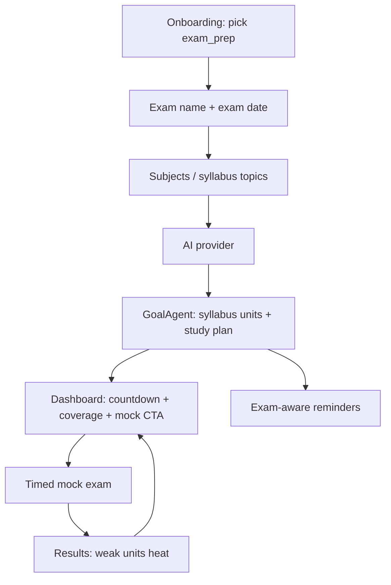
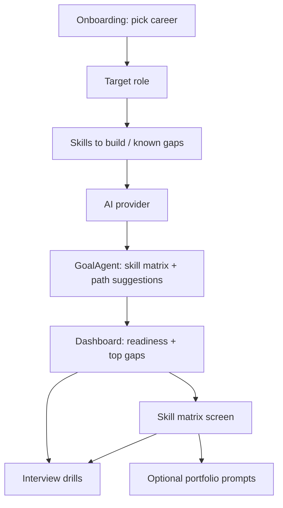

# Exam Prep & Career Role Modules — Full Product & Technical Design

> **Status:** Design accepted (scope 3) — documentation first; implement in phases below.  
> **Date:** 2026-07-08  
> **Product intent:** Keep **Learn something new** as the baseline UX. Deepen **Crack an exam** and **Prepare for a new role** from onboarding through first-week dashboard into full modules (timed mocks, syllabus units, interview drills, career skill matrix).  
> **Out of scope:** Recovery & wellness (removed).

---

## 1. Goals & non-goals

### Goals

| Mode | Primary job | Success metric |
|------|-------------|----------------|
| `exam_prep` | Pass a named exam on a date with measurable syllabus coverage | Syllabus % rises week over week; mock score trend; reminders respect exam date |
| `career` | Become role-ready with a visible skill matrix and interview practice | Gap list shrinks; readiness % from real skill targets; drill completion |
| `learning` | Unchanged exploration / discovery UX | No regressions |

### Non-goals (v1 of this design)

- Paid question banks / publisher syllabi imports
- Live proctoring
- Video/voice interview capture (text + rubric first)
- Replacing Isar with a server syllabus DB

---

## 2. Current state (baseline)

### Goal modes today

| Value | Onboarding extras | Dashboard | Data |
|-------|-------------------|-----------|------|
| `learning` | None | Default pulse / weak topics | `goalsJson` topics |
| `exam_prep` | Optional `examDate` | Countdown + fake syllabus % | `examDate`, no exam name field |
| `career` | Optional role → `goalContext` | Readiness card with binary % | Role text only |

### Critical gaps

1. **Onboarding** does not require exam date / role; page 1 copy is mode-agnostic (“goals”).
2. **Syllabus coverage %** is derived from weak-topic heuristics, not units.
3. **Career readiness %** collapses to 0% if any weak topic exists.
4. Quiz timers are **per-question only** — no exam-duration mocks.
5. No `QuizKind.mock` / interview kinds; no syllabus or skill-matrix collections.
6. Notifications ignore `examDate`.
7. `GoalAgent` seeds paths generically after provider save, not mode-structured plans.

### Reusable building blocks

| Asset | Path | Reuse for |
|-------|------|-----------|
| `LearnerProfile` (`goalMode`, `goalContext`, `examDate`, `goalsJson`) | `lib/data/local/models/learner_profile.dart` | Extend, don’t fork |
| `QuizSession` + AI generate | `quiz_session.dart`, `create_quiz_screen.dart` | Mock exams |
| `TopicNode.strength` | `topic_node.dart` | Skill evidence input |
| `LearningPath` + path steps JSON | `learning_path.dart`, `path_steps_storage.dart` | Optional link to syllabus units / skill tracks |
| `GoalAgent` | `lib/core/agents/goal_agent.dart` | Mode-specific seed JSON |
| `RecommendationEngine._weightsForMode` | `recommendation_engine.dart` | Keep + add urgency signals |
| Reminder prefs / `NotificationService` | `notification_service.dart` | Exam countdown + mock slots |
| Dashboard cards | `_ExamCountdownBanner`, `_CareerReadinessCard` | Replace guts; keep placement strategy |

---

## 3. Product experience by mode

### 3.1 Shared principles (edutech best practices)

1. **Mode-framed language from minute zero** — onboarding labels, empty states, CTAs, and agent prompts never say generic “goals” when mode is exam/career.
2. **One primary metric on home** — exam: days left + syllabus %; career: role readiness %. Secondary metrics stay below fold.
3. **Practice before polish** — every card CTA opens a concrete action (mock, drill, skill gap quiz), not a generic “Learn” dump.
4. **Evidence-backed gauges** — percentages must come from stored units/skills × mastery, never weak-topic presence alone.
5. **Paced urgency** — reminders scale with time-to-exam / interview target; avoid panic-only (≤7 day) banners.
6. **Soft-required onboarding** — Continue blocked (or strongly warned) until exam date / role is set; topics collected in mode-native language.
7. **Settings parity** — anything set in onboarding is editable in Settings → Your goal.

### 3.2 Crack an exam — journey



**Onboarding (page 0 extras)**

| Field | Required | Storage |
|-------|----------|---------|
| Exam name (e.g. “AWS SAA”, “JEE Main”) | Soft-required | `goalContext` |
| Exam date | Soft-required | `examDate` |
| Optional: exam type chip (competitive / board / cert) | Optional | new `examType` on profile or JSON in prefs |

**Onboarding (page 1 reframed)**

- Title: “Syllabus topics” (not “Goals”)
- Hint: “Comma-separated subjects or units — e.g. Algorithms, OS, Networks”
- Persists to existing `goalsJson` **and** seeds `SyllabusUnit` rows on finish / GoalAgent run

**Dashboard (exam_prep)**

| Section order | Content |
|---------------|---------|
| 1 | Urgency strip when ≤14 days (escalate styling ≤7) |
| 2 | Exam countdown + **real** syllabus coverage + next mock CTA |
| 3 | This week’s unit focus (from study plan) |
| 4 | Learning pulse / QOTD (secondary) |
| 5 | Weak units (not generic weak topics) |

**Modules**

| Module | Behavior |
|--------|----------|
| Syllabus | Units with weight, mastery, last practiced |
| Study plan | Daily/weekly allocations from `examDate` and `dailyMinutesGoal` |
| Timed mock | Whole-exam timer; pass mark; attempt history |
| Review | Post-mock map: unit → miss rate |
| Reminders | T−30 / T−14 / T−7 / T−1 + preferred study window |

### 3.3 Prepare for a new role — journey



**Onboarding**

| Field | Required | Storage |
|-------|----------|---------|
| Target role | Soft-required | `goalContext` |
| Skills / gaps list | Soft-required (≥1) | `goalsJson` → seed `CareerSkill` |
| Optional: experience level | Optional | reuse `skillLevel` or new `roleSeniority` |

**Dashboard (career)**

| Section order | Content |
|---------------|---------|
| 1 | Role readiness card (matrix-derived %) + top 3 gaps |
| 2 | “Practice interview” / “Close a gap” CTAs |
| 3 | Learning pulse / QOTD |
| 4 | Suggested skill path |

**Modules**

| Module | Behavior |
|--------|----------|
| Skill matrix | Role skills with `current` vs `target` (0–1); gap = target − current |
| Gap quiz | Generate quiz focused on one skill |
| Interview drills | Behavioral / technical MCQ+short answer with AI rubric scores |
| Portfolio prompts | Optional checklist items (non-blocking v1) |

### 3.4 Learn something new

No structural change. Keep current onboarding extras (none), dashboard without exam/career cards, existing GoalAgent wording.

---

## 4. Information architecture & navigation

### Mode-aware home section builder

Introduce a small helper (e.g. `DashboardSectionPlanner`) rather than scattering `if (goalMode == …)` deeper:

```dart
enum DashboardSlot {
  urgency,
  primaryGoalCard,
  weeklyFocus,
  quizOfDay,
  learningPulse,
  gapsOrWeak,
  stats,
  ads,
  analytics,
}
```

| Mode | Primary order (first viewport) |
|------|--------------------------------|
| `learning` | quizOfDay → learningPulse → gapsOrWeak |
| `exam_prep` | urgency → primaryGoalCard → weeklyFocus → quizOfDay |
| `career` | primaryGoalCard → gapsOrWeak → quizOfDay |

Bottom nav stays shared. Optional later: promote Learn vs History affinity when `exam_prep` favors quiz history.

### New routes (proposed)

| Route | Screen | Mode |
|-------|--------|------|
| `/exam/syllabus` | Syllabus overview | exam_prep |
| `/exam/plan` | Study plan week view | exam_prep |
| `/exam/mock/create` | Mock config (duration, units, pass %) | exam_prep |
| `/exam/mock/play/:id` | Timed mock player | exam_prep |
| `/career/matrix` | Skill matrix | career |
| `/career/drill/create` | Interview drill setup | career |
| `/career/drill/play/:id` | Drill player | career |

Deep links from dashboard CTAs only; settings remains the edit surface for goal fields.

---

## 5. Data model

### 5.1 Extend `LearnerProfile`

| Field | Type | Notes |
|-------|------|-------|
| `goalMode` | String | unchanged |
| `goalContext` | String | exam name **or** role title |
| `examDate` | DateTime? | exam_prep |
| `goalsJson` | String | onboarding topic list (bootstrap only) |
| `examType` _(new)_ | String? | `cert` / `competitive` / `academic` / `other` |
| `interviewTargetDate` _(new)_ | DateTime? | optional career urgency |
| `roleSeniority` _(new)_ | String? | `junior` / `mid` / `senior` |

Keep Isar migrations defensive (same pattern as existing `goalMode` try/catch + put).

### 5.2 New: `Syllabus` + `SyllabusUnit`

```
Syllabus
  uuid
  title                 // often mirrors goalContext
  examDate
  learnerProfile linked implicitly (single active syllabus per user v1)
  source                // user | ai
  createdAt, updatedAt

SyllabusUnit
  uuid
  syllabusUuid
  title
  orderIndex
  weight                // relative importance 0–1; default equal
  mastery               // 0–1 from TopicNode / quiz evidence
  lastPracticedAt
  pathId?               // optional LearningPath link
  topicKeysJson         // topics feeding this unit
```

**Coverage formula (authoritative):**

\[
\text{coverage} = \frac{\sum_i w_i \cdot m_i}{\sum_i w_i}
\]

Dashboard must use this — never weak-topic heuristics.

### 5.3 New: `StudyPlanItem` (optional collection or JSON sidecar)

| Field | Meaning |
|-------|---------|
| `date` | calendar day |
| `unitUuid` | focus unit |
| `plannedMinutes` | from daily goal + urgency curve |
| `completedMinutes` | tracked |
| `kind` | `study` / `mock` / `review` |

**Urgency curve (guidance):** more mock slots in final 14 days; more unit study earlier.

### 5.4 Extend quiz for mocks

`QuizKind` additions:

```dart
static const mock = 'mock';
static const interview = 'interview';
```

`QuizSession` new fields:

| Field | Purpose |
|-------|---------|
| `examDurationSeconds` | whole-exam timer (null = legacy per-question only) |
| `passPercent` | default 60–70 by exam type |
| `syllabusUuid` | link |
| `unitFilterJson` | units included in mock |
| `attemptNumber` | 1-based |
| `scorePercent` | denormalized for trends |

**Play UX:** when `examDurationSeconds != null`, show global countdown; disable skipping past unfinished if configured; allow mark-for-review (nice-to-have v1.1).

### 5.5 New: `CareerSkill`

```
CareerSkill
  uuid
  roleTitle             // denormalized from goalContext
  title                 // e.g. "System Design"
  category              // technical | behavioral | tool | domain
  targetLevel           // 0–1
  currentLevel          // 0–1 (Evidence from TopicNode / drills)
  evidenceTopic         // topic string for TopicNode join
  orderIndex
  updatedAt
```

**Readiness formula:**

\[
\text{readiness} = \frac{\sum_i \min(1, c_i / t_i) \cdot w_i}{\sum_i w_i}
\quad (t_i > 0)
\]

Use equal weights v1 unless GoalAgent returns weights.

### 5.6 New: interview drill artifacts

Prefer extending `Question` carefully:

| Approach | Choice for v1 |
|----------|----------------|
| Multimodal voice | Defer |
| Short text + MCQ | Supported |
| Rubric | Store on question: `rubricJson` + `aiScore` (0–1) |

Optional `InterviewDrillSet` collection if multi-question sets need titles (“Behavioral round 1”).

### 5.7 Schema registration

Update `lib/data/local/isar_service.dart` schemas + run `dart run build_runner build`. Document destructive vs additive migration policy: **additive fields with defaults**; wipe only in debug if schema conflict.

---

## 6. Onboarding specification

### Page 0 — Goal mode

Keep three cards. Expand extras:

**exam_prep**

1. Exam name `TextField` → `goalContext`
2. Exam date button (required to Continue)
3. Optional exam type chips

**career**

1. Role `TextField` (required)
2. Optional seniority chips

**Validation**

- Soft-required: show inline error on Continue if missing; do not allow skip without confirm dialog (“You can set this later in Settings”).

### Page 1 — Profile (mode copy matrix)

| Element | learning | exam_prep | career |
|---------|----------|-----------|--------|
| Title | existing `welcomeTitle` | “Set up your exam plan” | “Map your target role” |
| Goals label | Goals | Syllabus topics | Skills to build |
| Goals hint | … | Subjects / units… | Skills & gaps… |
| Daily minutes | Study minutes | Study budget until exam | Prep minutes / day |

### Page 2 — Provider

Unchanged UX; after save, trigger enhanced `GoalAgent` with mode-specific schema (see §7).

### Finish payload

```
goalMode, goalContext, examDate?, examType?,
goals[], dailyMinutesGoal, roleSeniority?,
→ create Syllabus+Units OR CareerSkills from goals
→ upsert TopicNodes
→ schedule exam reminders if exam_prep
→ dashboard
```

Mirror all editable fields in `_GoalModeSettingsCard`.

---

## 7. GoalAgent v2 schema

Keep one agent; branch prompt + expected JSON.

### exam_prep response shape

```json
{
  "examTitle": "string",
  "syllabusUnits": [
    { "title": "string", "weight": 0.2, "topics": ["..."], "targetMastery": 0.7 }
  ],
  "studyPlanHints": [
    { "weekOffset": 0, "focusUnits": ["..."], "mockThisWeek": false }
  ],
  "recommendedDailyMinutes": 45,
  "recommendedMockDurationMinutes": 90,
  "nudgeMessages": ["..."],
  "suggestedPaths": [{ "title": "...", "topics": ["..."] }]
}
```

### career response shape

```json
{
  "roleTitle": "string",
  "skills": [
    {
      "title": "string",
      "category": "technical|behavioral|tool|domain",
      "targetLevel": 0.8,
      "seedLevel": 0.2,
      "topics": ["..."]
    }
  ],
  "interviewDrillThemes": ["System design", "Behavioral leadership"],
  "recommendedDailyMinutes": 30,
  "nudgeMessages": ["..."],
  "suggestedPaths": [{ "title": "...", "topics": ["..."] }]
}
```

Persist into new collections; fall back to creating one unit/skill per onboarding goal topic if AI fails.

---

## 8. Recommendation & notification updates

### RecommendationEngine

| Mode | Additional logic |
|------|------------------|
| `exam_prep` | Boost units with low mastery × high weight; if days left ≤ 14, prefer `mock` recommendations |
| `career` | Prefer skills with largest `(target − current)`; inject interview drill nudges weekly |
| `learning` | Existing weights |

### Notifications

| Trigger | Channel proposal |
|---------|------------------|
| Daily study (existing) | Keep; body mentions exam name / role when set |
| Exam countdown | New IDs; schedule at T−30/−14/−7/−1 at preferred hour |
| Mock due | When study plan marks mock day |
| Interview practice | Weekly soft nudge for career |

Extend `ReminderPreferences` with `examRemindersEnabled` (default true for exam_prep).

---

## 9. UI / visual system

| Mode | Accent (existing) | Tone |
|------|-------------------|------|
| learning | `#5B4BDB` | Explore, curiosity |
| exam_prep | `#E67E22` | Focus, countdown, completion |
| career | `#27AE60` | Growth, competence |

Rules:

- Do not introduce a fourth palette.
- Primary goal card uses mode accent; rest of chrome stays app purple seed where appropriate.
- Avoid card spam: one primary metric card + one CTA group in first viewport (aligns with product UI rules).
- Replace placeholder syllabus/readiness math in `dashboard_screen.dart` before shipping new chrome.

---

## 10. Localization

Add keys (English first in `app_en.arb`, then generate / mirror locales):

| Area | Examples |
|------|----------|
| Onboarding | `onboardingExamTitle`, `onboardingSyllabusLabel`, `onboardingRoleRequired`, … |
| Exam module | `examSyllabusTitle`, `examCoveragePct`, `examStartMock`, `examPassMark`, … |
| Career module | `careerMatrixTitle`, `careerGapLabel`, `careerStartDrill`, … |
| Reminders | `reminderExamInDays`, … |

Remove leftover recovery strings permanently (already done).

---

## 11. Phased delivery plan

### Phase 0 — Documentation & contracts (this doc)

- [x] Product + schema + flows documented  
- [ ] Track tickets / checklists against sections below

### Phase 1 — Onboarding & settings parity (foundation)

**Effort:** small–medium  
**Status:** implemented 2026-07-08 · **Eval: Pass** (2026-07-08)

1. [x] Soft-require exam date / role; exam name → `goalContext`.  
2. [x] Mode-specific page 0 / page 1 copy (l10n).  
3. [x] Settings goal card parity + clear `examDate` when leaving exam mode.  
4. [x] Fix save button label (`Save goal` vs `Goal updated` snackbar).  
5. [x] Persist `examType` / `roleSeniority`.

**Exit criteria:** New users in exam/career cannot finish without goal identity (or confirm skip dialog); dashboard title/context shows exam name or role.

### Phase 2 — Real metrics & dashboard IA

**Effort:** medium  
**Status:** implemented 2026-07-08 · **Eval: Partial → Pass with Phase 3 harden** (2026-07-08)

1. [x] Implement `Syllabus` / `SyllabusUnit` **or** `CareerSkill` bootstrap from `goalsJson` (even without AI).  
2. [x] Replace fake % in `_ExamCountdownBanner` / `_CareerReadinessCard`.  
3. [x] `DashboardSectionPlanner` reorder.  
4. [x] CTAs: `/exam/mock/create`, `/career/matrix` (can stub screens).  

**Exit criteria:** Percentages move when users practice mapped topics; learning mode unchanged.  

**Eval notes:** Formulas and planner were complete; coverage motion was fragile (exact topic match only). Phase 3 adds `applyPracticeEvidence` so mock/practice completion updates unit mastery from selected unit titles.

### Phase 3 — Timed mock exams

**Effort:** medium–large  
**Status:** implemented 2026-07-08

1. [x] `QuizKind.mock` + `examDurationSeconds` on session.  
2. [x] Mock create UI (duration presets 30/60/90/180, unit multi-select, pass %).  
3. [x] Play screen global timer + results trend chart (last N attempts).  
4. [x] Recommendation kind `mock`.  

**Exit criteria:** User can complete a timed mock end-to-end offline (AI generate + local play).  

**Also shipped:** `passPercent`, `syllabusUuid`, `unitFilterJson`, `attemptNumber`, `scorePercent`; mastery sync after mock submit.
### Phase 4 — Career matrix & interview drills

**Effort:** large  
**Status:** implemented 2026-07-08

1. [x] Matrix UI CRUD + readiness formula.  
2. [x] Gap-focused quiz launch.  
3. [x] `QuizKind.interview` + short-answer questions + AI scoring rubric.  
4. [x] Drill themes from GoalAgent.  

**Exit criteria:** Career home shows matrix-backed readiness; one drill completable.  

**Also shipped:** `/career/drill/create`, short-answer play UI, `InterviewRubricScorer`, recommendation kind `interview`, `skill_updated` / `drill_completed` telemetry.

### Phase 5 — Study plan & exam-aware notifications

**Effort:** medium  
**Status:** implemented 2026-07-08

1. [x] Generate `StudyPlanItem`s from exam date + units.  
2. [x] Week view under `/exam/plan`.  
3. [x] Schedule countdown notifications; preference toggles.  

**Exit criteria:** T−7 reminder fires in debug; plan reflects daily minutes.

**Also shipped:** `StudyPlanItem` Isar collection, `ExamNotificationScheduler` (T−30/−14/−7/−1 + mock-due), `examRemindersEnabled` preference, study minutes credited after quizzes, dashboard study-plan CTA.

### Phase 6 — GoalAgent v2 + polish

**Effort:** medium  
**Status:** implemented 2026-07-08

1. [x] Mode-specific JSON schemas & persistence.  
2. [x] Empty states, l10n across locales, analytics events (`mock_completed`, `skill_updated`, …).  
3. [x] History filters by `quizKind`.  

**Exit criteria:** First provider save seeds mode-appropriate syllabus/skills; history filters mock + interview; telemetry events fire on seed/completion.

**Also shipped:** `GoalAgent` v2 prompts (exam/career/learning), `seedSyllabusFromAgent` / `seedCareerSkillsFromAgent`, history empty state with CTA, `quizKindMock` / `quizKindInterview` labels, `syllabus_seeded` / `career_matrix_seeded` / `goal_agent_seeded` telemetry.

## 12. File ownership map (implementation)

| Area | Primary files |
|------|----------------|
| Onboarding | `lib/features/onboarding/presentation/welcome_screen.dart` |
| Settings goal | `lib/features/settings/presentation/settings_screen.dart` (`_GoalModeSettingsCard`) |
| Dashboard | `lib/features/dashboard/presentation/dashboard_screen.dart` |
| Personalization | `lib/core/personalization/ui_personalization_controller.dart` |
| Profile / repo | `learner_profile.dart`, `learner_repository.dart` |
| Isar | `isar_service.dart` + new model files |
| Quiz kinds / play | `quiz_kind.dart`, `quiz_session.dart`, `quiz_play_screen.dart`, `create_quiz_screen.dart` |
| Agent | `goal_agent.dart` |
| Recs | `recommendation_engine.dart` |
| Notifications | `notification_service.dart`, `reminder_preferences.dart` |
| Router | `app_router.dart` |
| l10n | `app_en.arb` + generated |

New feature folders (suggested):

```
lib/features/exam/
  presentation/syllabus_screen.dart
  presentation/study_plan_screen.dart
  presentation/mock_create_screen.dart
lib/features/career/
  presentation/skill_matrix_screen.dart
  presentation/drill_create_screen.dart
```

---

## 13. Analytics / telemetry events

| Event | Payload highlights |
|-------|--------------------|
| `onboarding_completed` | existing + `examType` / hasExamDate |
| `syllabus_seeded` | unitCount |
| `mock_started` / `mock_completed` | duration, scorePercent, pass |
| `career_matrix_seeded` | skillCount |
| `drill_completed` | category, aiScore |
| `exam_reminder_scheduled` | daysBefore |

Respect `helpImproveOptIn` for cloud sync; local telemetry always OK.

---

## 14. Testing checklist

- [ ] Learning onboarding → dashboard unchanged layout order  
- [ ] Exam onboarding without date shows validation  
- [ ] Career without role shows validation  
- [ ] Coverage % after mastering a unit via quiz  
- [ ] Readiness % after raising a skill’s currentLevel  
- [ ] Mock timer expiry submits / auto-finishes safely  
- [ ] Leaving exam mode in settings clears or hides countdown  
- [ ] Legacy `goalMode: recovery` still migrates to learning  
- [ ] Provider skip still reaches dashboard; agent failure falls back to topic units/skills  
- [ ] l10n keys resolve in `en`  

---

## 15. Risks & mitigations

| Risk | Mitigation |
|------|------------|
| Isar schema migration breaks installs | Additive fields only; version gate in `IsarService` |
| AI syllabus quality varies | Deterministic fallback: 1 unit/skill per goal topic |
| Mock UX complexity | Ship duration + simple play before mark-for-review |
| Scope creep into full LMS | Stick to phases; no publisher content v1 |
| Dashboard clutter | One primary card rule; planner enforces order |

---

## 16. Open decisions (defaults locked for build)

| Decision | Default |
|----------|---------|
| Exam name storage | `goalContext` (no parallel field) |
| Syllabus source of truth | New Isar collections (not path_steps alone) |
| Interview answers v1 | Text + MCQ + AI rubric score |
| Mock timer | Global `examDurationSeconds`; per-question timer optional off for mocks |
| First viewport | Mode planner (§4) |
| Implementation start | Phase 1 after this doc is accepted for coding |

---

## 17. README touchpoint

When Phase 1+ ships, update root `README.md` Features list:

- Exam prep: syllabus coverage, timed mocks, exam-aware reminders  
- Career: skill matrix, interview drills, readiness tracking  

Link to this document: `docs/EXAM_AND_CAREER_MODULES.md`.

---

## Appendix A — Best-practice sources (product)

- **Spaced practice + exam countdown:** front-load learning early; increase full-length mocks in final 2 weeks.  
- **Mastery learning:** unit weights × mastery beats “number of weak topics.”  
- **Career frameworks:** map role → skills → evidence (quiz/drill), similar to competency matrices used in L&D products — show gaps, not vanity %.  
- **Onboarding commitment:** collecting deadline + identity (exam/role) increases retention vs topic list alone.  
- **Single primary CTA:** reduces decision fatigue on student home screens.

## Appendix B — Glossary

| Term | Meaning |
|------|---------|
| Syllabus unit | Gradable chunk of exam content with weight & mastery |
| Mock | Full timed practice under exam-like constraints |
| Skill matrix | Role skill rows with target vs current levels |
| Drill | Short interview-style practice set |
| Goal context | Human-readable exam name or job role string |

---

*End of design. Implementation should follow phases 1→6 without skipping metric honesty (Phase 2) before mock/drill chrome (Phases 3–4).*
